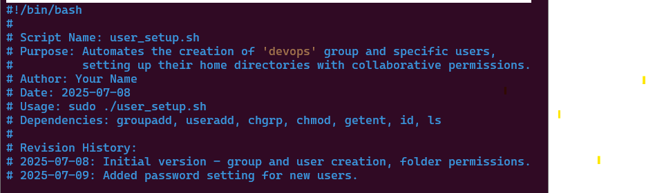
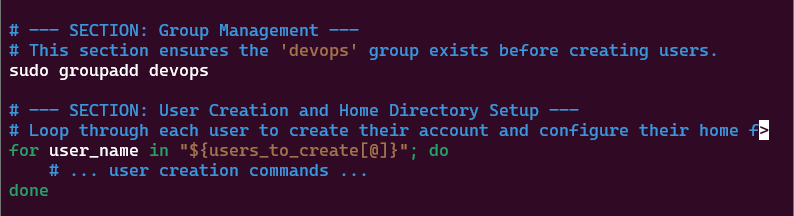
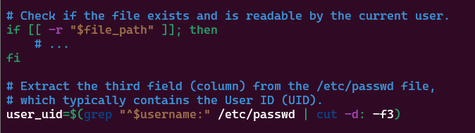
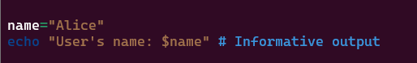

# linux-shell-scripting2
Linux Shell Scripting (Comments)  are essential in programming, they serve as simply notes to the programmer and anyone else reading the code.

## Comments

Comments in programming (like in Bash scripts, Python, or any other coding language) are simply notes or explanations that you write within your code, but which the computer completely ignores when it runs the program.

They are there purely for humans to read and understand the code better.

Think of them like:

* Sticky notes you put on a recipe to explain why you added an ingredient.

* Road signs that tell you what a section of the road is for.

* Explanations in a book that help you understand a difficult part.

Their main purpose is to make your code clearer, easier to understand, and simpler to work with for anyone (including yourself!) who reads it later.

## Single-Line Comments

Single- line comments in Bash start with the # symbol. Anything following this symbol on the same line is treated as a comment and is not executed.

## Multiple Single-Line Comments

This approach is straightforward and is commonly used for adding brief descriptions or notes spanning multiple lines.

## Best Practices for Commenting

1. Comment Why, Not Just What

* Bad: echo "Hello" # Prints "Hello"
(This is obvious from the code itself)

* Good: echo "Starting script to confirm user setup" # Inform user about the script's purpose
(Explains the reason for printing "Hello")

* Rule: If the code is self-explanatory, don't just re-state it. Explain the logic, the intention, or the reasoning behind a block of code.

2. Keep Comments Concise and Up-to-Date

* Concise: Don't write a novel. Get straight to the point.

* Up-to-Date: This is critical! Outdated comments are worse than no comments, as they can mislead. If you change the code, change the comment too.

* Rule: A short, accurate comment is better than a long, outdated one.

3. Use a Script Header (at the very top)

* Provide a brief overview of the entire script. This is like the title page of a book.

* Include:

* Script Name

* Purpose/Description

* Author

* Date Created/Last Modified

* Usage instructions (how to run it)

* Dependencies (what programs it needs)

* Revision History (optional, for major changes)

4. Comment Major Sections or Blocks of Logic

* Use blank lines and multi-line comments (or a series of single-line comments) to separate and explain different parts of your script.

* This helps readers quickly navigate the code.

5. Comment Complex or "Tricky" Lines

* If a line of code is not immediately obvious, or if it's doing something clever or unusual, explain it.

* This is especially true for complex awk, sed, or regular expression commands.

6. Avoid Redundant Comments

* Don't comment on every single line if it's clear. Cluttering the code with unnecessary comments can make it harder to read.

Bad:

Good:

7. Use Consistent Style

* Decide on a style (e.g., # at the beginning of a line, or  # for inline comments) and stick to it throughout your script.

* Consistent indentation and spacing for comments also improve readability.

***By following these practices, your Bash scripts will be much more maintainable, understandable, and professional.***